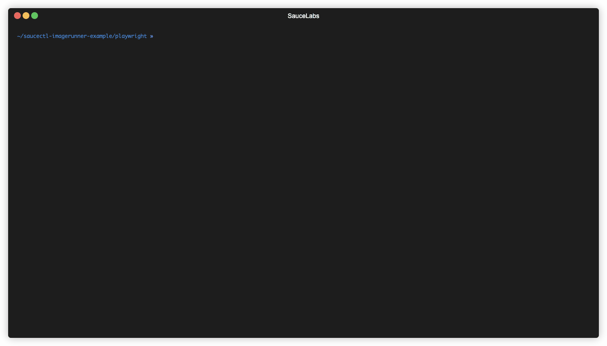

# Sauce Orchestrate ImageRunner Examples: Playwright

This is an example how to run Sauce Orchestrate ImageRunner using Playwright.

## What You'll Need

If you just want to run the test, you'll need to have `saucectl` [installed and configured](https://docs.saucelabs.com/dev/cli/saucectl/#installing-saucectl):

```shell
npm install -g saucectl
saucectl configure
```

Everything else is already set up for this example - there's no need to write tests, build the Docker image or push it
to any repository. If you want, you can review [`saucectl` configuration](./.sauce/config.yml).

## How to run the test?

Choose one of these commands depending on where you want to run your tests:

```shell
saucectl run --live-logs  # for the region specified in the config file, with live logs enabled
saucectl run --live-logs --region us-west-1  # for us-west-1 region, with live logs enabled
saucectl run --live-logs --region eu-central-1  # for eu-central-1 region, with live logs enabled
```



Keep in mind that this recording might not fully represent actual execution due to possible changes in our solutions.

## How do I customize this example?

1. Download a copy of this repository.
2. Make a change to the code.
3. Make sure that [Dockerfile](Dockerfile) is up-to-date with your needs.
4. Build the image and push it to your own Docker registry.
5. Replace `image` in the [saucectl configuration](.sauce/config.yml) to match the image you've just built.
6. Run tests!

## Want to learn more?

If you want to learn more about Sauce Orchestrate to be able to run your own tests, feel free to use
[Sauce Orchestrate documentation](https://docs.saucelabs.com/orchestrate/).
